[](https://github.com/loukesio/ltc-color-palettes/actions/workflows/R-CMD-check.yml)
[](https://github.com/loukesio/ltc-color-palettes/actions/workflows/docker-build.yml)
[](https://cran.r-project.org/package=ltc)
[](https://opensource.org/licenses/MIT)
[](https://cran.r-project.org/package=ltc)

📖 **Website & interactive palette explorer:** <https://loukesio.github.io/ltc-color-palettes/>


## Install package
Install the package using the following commands  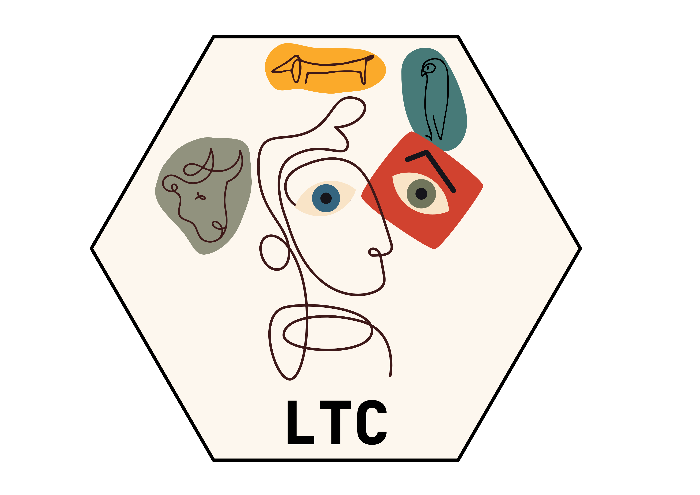

```r
# Install the released version from CRAN
install.packages("ltc")

# Or, if you want the latest development version from GitHub:
# install.packages("devtools")
devtools::install_github("loukesio/ltc-color-palettes")

# and load it
library(ltc)
```

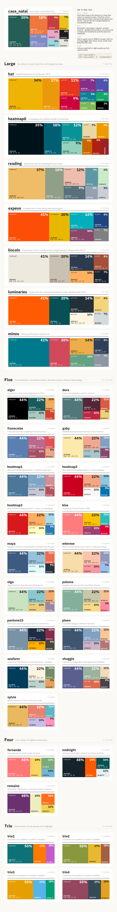

## Palettes in action

Every palette in the package, shown across six chart types — a map, a Voronoi
treemap, a heatmap, a bubble chart, a barplot and a streamgraph:

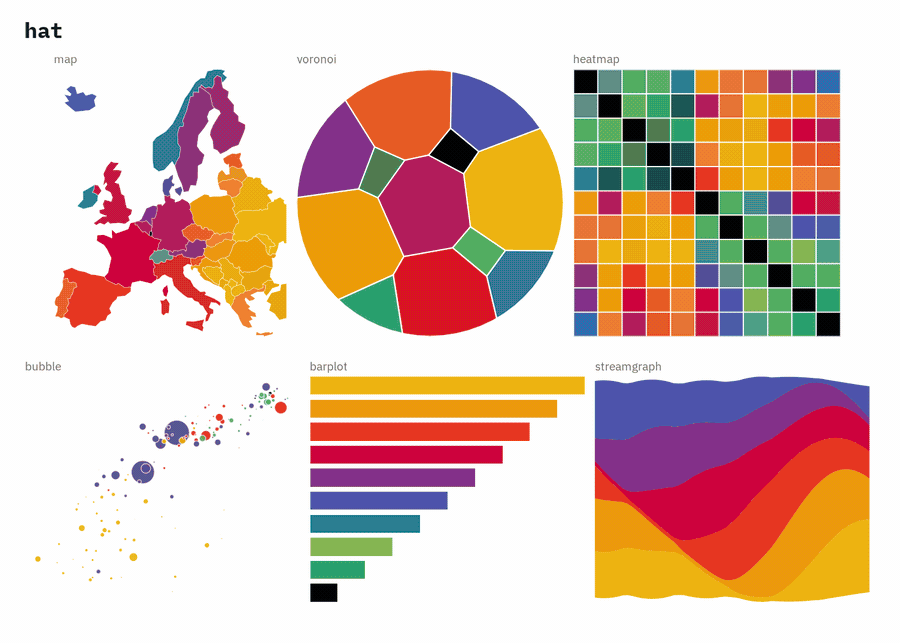

Try them yourself in the [**interactive palette explorer**](https://loukesio.github.io/ltc-color-palettes/palette-explorer.html) — switch between palettes, darken or brighten them, and check how they hold up under colour-vision deficiency.

A couple of examples of `ltc` palettes on real data. Every palette works as a
discrete scale, a continuous scale, or a diverging one.

A discrete scale — life expectancy against income across the world in 2007,
coloured by continent with the `expevo` palette:

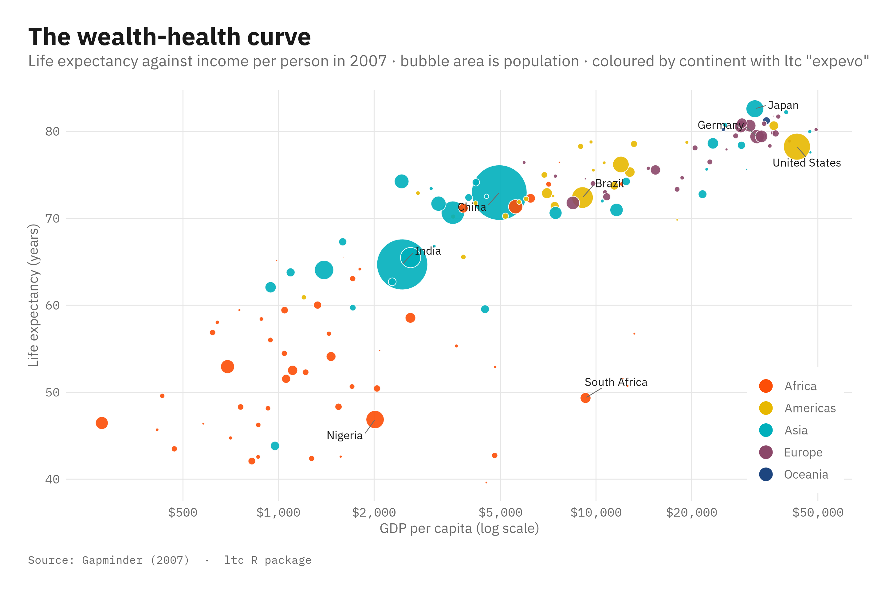

And a continuous scale — estimated GDP per capita across Europe, drawn with the
`heatmap0` palette:

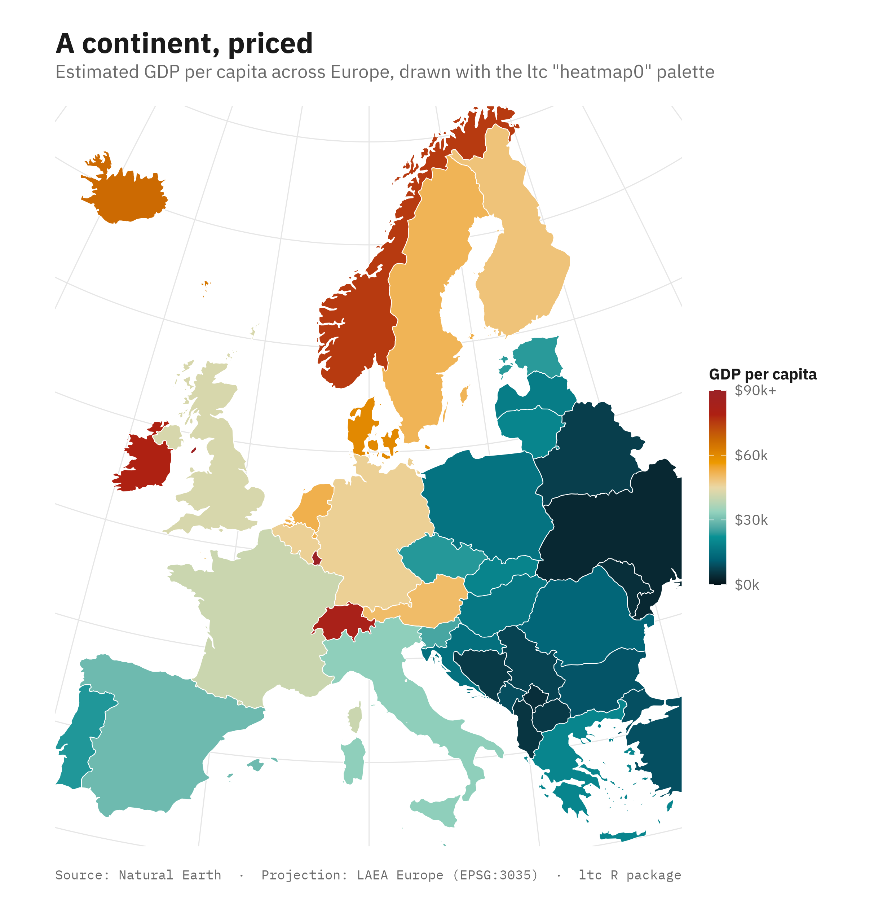

## How can I use the `ltc` package?

### Show all palettes
``` r
library(ltc)
names(palettes)
#>  [1] "paloma"     "maya"       "dora"       "ploen"      "olga"      
#>  [6] "mterese"    "gaby"       "franscoise" "fernande"   "sylvie"    
#> [11] "expevo"     "minou"      "kiss"       "hat"        "reading"   
#> [16] "alger"      "trio1"      "trio2"      "trio3"      "trio4"     
#> [21] "heatmap0"   "pantone23"  "remains"    "midnight"   "lincoln"   
#> [26] "luminaries" "seafarer"   "shuggie"    "heatmap1"   "heatmap2"  
#> [31] "heatmap3"   "casa_natal"
```

### Choose the palette you like and print it
- choose it using the `ltc` command.
``` r
alger <- ltc("alger") #in this case you select alger
```
- after choosing the palette print it using the `pltc` command!
``` r
plot(alger)
```
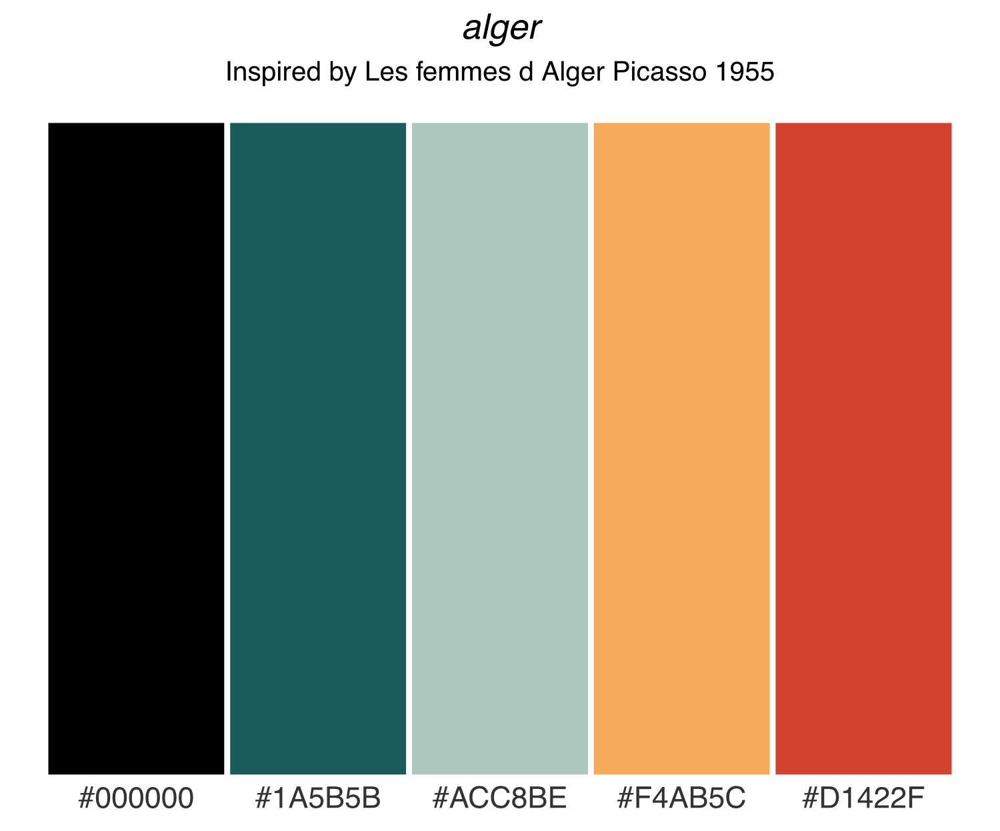

- you can also print the palette you have chosen in a bird-shape, in here we are using `dora`

``` r
library(ltc)
pantone23 <- ltc("pantone23")
bird(pantone23)
```
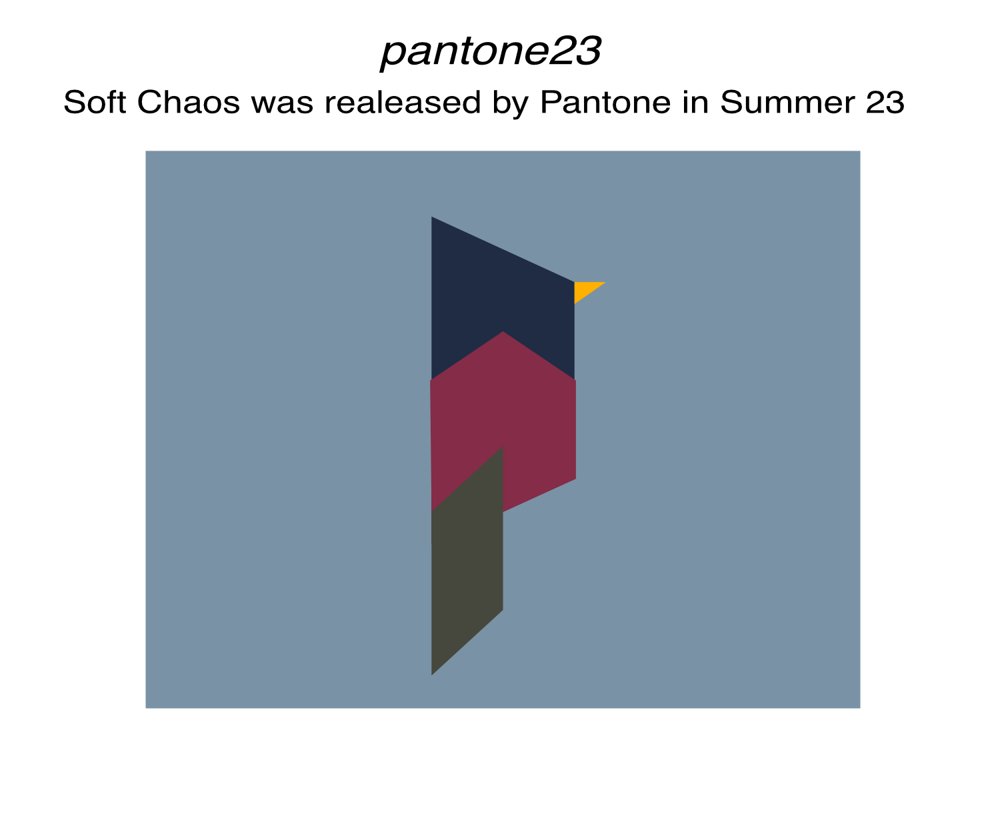

<sup>Created on 2023-09-03 with [reprex v2.0.2](https://reprex.tidyverse.org)</sup>

### Use a palette directly in ggplot2

`scale_fill_ltc()` and `scale_colour_ltc()` work like `scale_fill_viridis()`,
so you don't need `scale_fill_manual(values = ...)`:

``` r
library(ggplot2)
library(ltc)

# discrete
ggplot(mtcars, aes(factor(cyl), mpg, fill = factor(cyl))) +
  geom_boxplot() +
  scale_fill_ltc(maya)

# continuous
ggplot(faithfuld, aes(waiting, eruptions, fill = density)) +
  geom_raster() +
  scale_fill_ltc(heatmap0, discrete = FALSE)

# reverse the palette
scale_colour_ltc(alger, direction = -1)
```

`scale_color_ltc()` is the same function under the US spelling. For other scale
constructors, `ltc_pal()` returns a palette function of `n`:

``` r
ltc_pal(maya)(3)
#> [1] "#3d5a80" "#98c1d9" "#e0fbfc"
```

### Adjust a palette — darken, brighten, or desaturate

Every palette can be tuned without leaving the package. `adjust_ltc()` darkens
(negative `amount`) or lightens (positive `amount`) the colours, and
`desaturate_ltc()` mutes them:

``` r
library(ltc)

adjust_ltc(maya, amount = -30)      # darker
adjust_ltc(maya, amount =  30)      # lighter
desaturate_ltc(maya, amount = 0.6)  # muted

# tune individual colours, or give each its own amount
adjust_ltc(maya, amount = -25, which = c(1, 4))
custom_adjust_ltc(maya, c(-40, -20, 0, 20, 40))
```

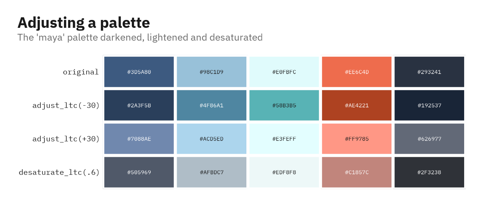

### Check colour-vision accessibility

`ltc_cvd()` simulates how a palette looks to viewers with the three main types of
colour-vision deficiency, so you can check that the colours stay distinct:

``` r
library(ltc)

ltc_cvd(maya)                     # normal + deuteranopia / protanopia / tritanopia
ltc_cvd("expevo", severity = 0.6) # milder simulation
```

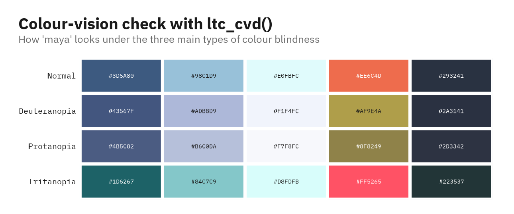

### Test how the palette looks like in plots...

- Example 1 - Hexagon diagram

``` r
library(ggplot2)
library(ltc)
pal=ltc("heatmap0",10,"continuous")

ggplot(data.frame(x = rnorm(1e4), y = rnorm(1e4)), aes(x = x, y = y)) +
  geom_hex() +
  coord_fixed() +
  scale_fill_gradientn(colours = pal) +
  theme_void()
```
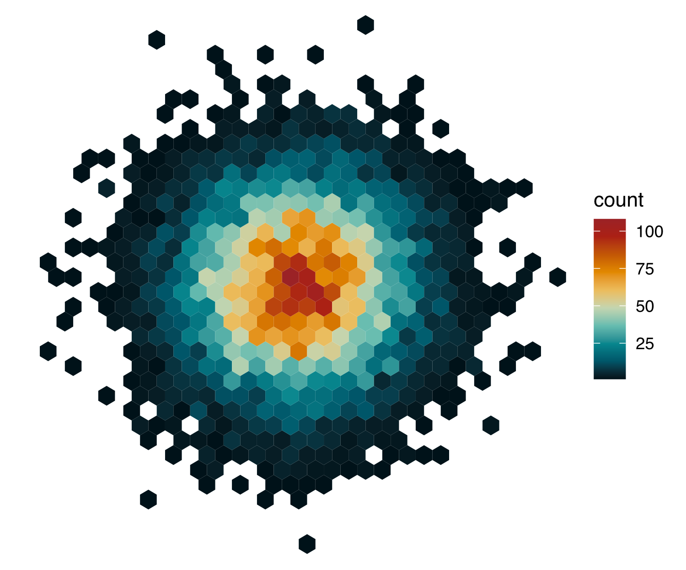

<sup>Created on 2023-09-03 with [reprex v2.0.2](https://reprex.tidyverse.org)</sup>


- Example 2 - Histogram

``` r
library(ltc)
library(ggplot2)
pal=ltc("alger",5,"continuous")

ggplot(diamonds, aes(price, fill = cut)) +
  geom_histogram(binwidth = 500, position = "fill") +
  scale_fill_manual(values = pal) +
  theme_bw() +
  theme(panel.grid.major = element_blank(), panel.grid.minor = element_blank())
```
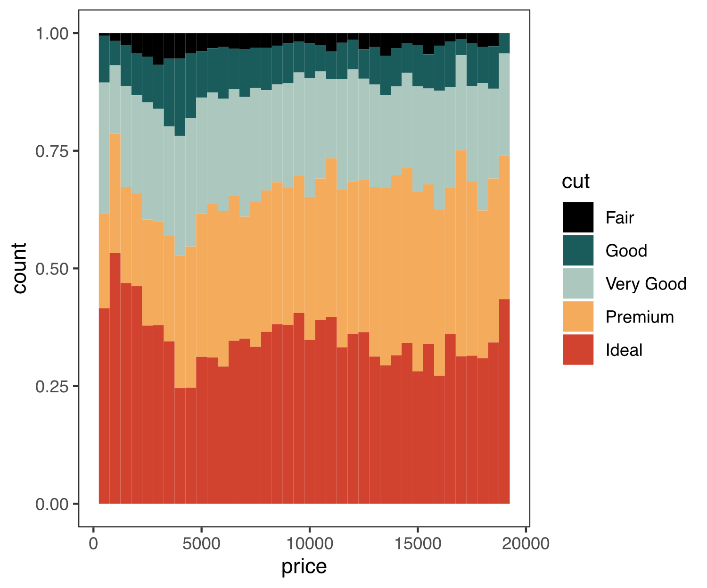

<sup>Created on 2023-09-03 with [reprex v2.0.2](https://reprex.tidyverse.org)</sup>

## Contributions
The `ltc` package is developed and maintained by Loukas Theodosiou (theodosiou@evolbio.mpg.de). For the palettes I drew inspiration from the drawings and life of Pablo Picasso as well as from the following books 
<p float="left">
  
  
</p> 

## Roadmap

Version 0.4.0 is on CRAN. Planned for the next version:

- [x] `ltc()` accepts a variable holding a palette name, e.g. `pal <- "remains"; ltc(name = pal)` — in addition to `ltc("remains")` and `ltc(remains)`. *(done)*
- [x] Apply the same name resolution to `adjust_ltc()`, `custom_adjust_ltc()` and `desaturate_ltc()` so they also accept a variable holding a palette name. *(done)*
- [x] Add ggplot2 scales — `scale_fill_ltc()`, `scale_colour_ltc()`, `scale_color_ltc()` and `ltc_pal()` — in the style of `scale_fill_viridis()`. *(done)*
